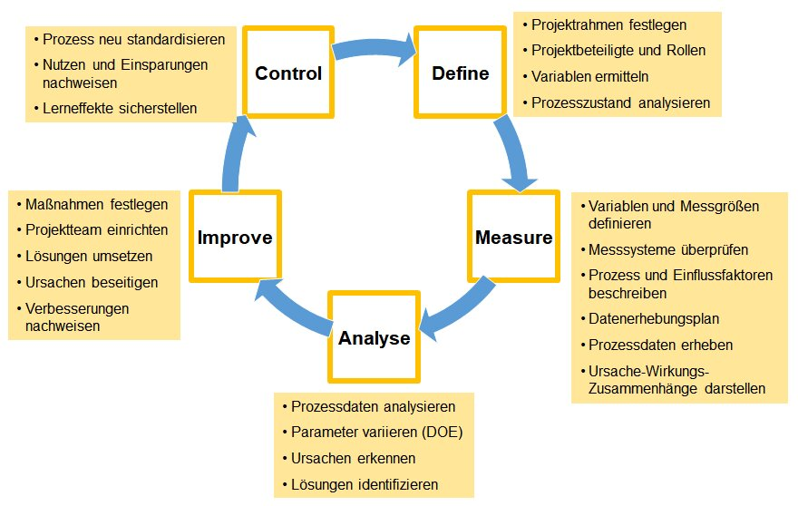

Das Akronym DMAIC steht für den Kernprozess des Qualitätsmanagement-Ansatzes Six Sigma und beschreibt dessen Phasen Define – Measure – Analyse – Improve – Control (dt. Definieren – Messen – Analysieren – Verbessern – Steuern).
Als Prozessoptimierungsprozess zielt er auf die Verbesserung von bestehenden Produkten ab; damit verwandte Ansätze sind DMADV (DV: Design – Verify) für neue Produkte und DMAEC (E = Engineering) für neue Prozesse. DMAIC fasst bekannte Vorgehensweisen und Methoden zu einem systematischen Ansatz zusammen. Dabei werden die Werkzeuge über die einzelnen Phasen miteinander verknüpft, die Projektarbeit wird dadurch chronologisch strukturiert und systematisiert.

# Define – Definieren. Was ist das Problem?

In dieser Phase wird der Ist-Zustand dokumentiert und definiert, wer die Kundschaft (im weitesten Sinn) des Prozesses ist und welche Kundenbedarfe er erfüllen soll. Auf dieser Basis werden dann die Leistungsmerkmale des Prozesses definiert, die kritisch für die Erfüllung der Kundenerwartungen sind. Zudem werden Projektparameter wie Umfang, Grenzen und Zeiträume festgelegt.

# Measure – Messen: Wie lässt sich die Auswirkung messen?

Daten, Zahlen und Fakten liefern die Basis für ein erfolgreiches Verbesserungsprojekt. Messen bedeutet in dieser Phase, die derzeitige Ausprägung der Leistungsmerkmale festzustellen. Dazu wird der Prozess zunächst in Teilprozesse aufgegliedert und visualisiert (Process-Mapping). Auf dieser Basis können mögliche Einfluss- und Ausgangsgrößen ermittelt sowie Methoden und Instrumente zur Erhebung von Daten aus den einzelnen Prozessschritten festgelegt werden. Ziel ist, die Funktionalität des Prozesses zu erfassen. Als Werkzeuge stehen dafür unter anderem statistische und grafische Methoden sowie Prozess- und Messsystemfähigkeitsuntersuchungen zur Verfügung. Nach Abschluss diese Phase liegen beispielsweise ein Datenerfassungsplan, Datenerfassungsblätter, Häufigkeitsdiagramme (Histogramme), Messsystemanalysen, eine Prioritätsmatrix sowie eine FMEA (Failure Mode and Effects Analysis, dt.: Fehlermöglichkeits- und -einflussanalyse, kurz Auswirkungsanalyse) vor.

# Analyse – Analysieren. Welche Ursachen hat das Problem?

Ziel der Analysephase ist, die Ursache-Wirkungs-Beziehungen zwischen In- und Outputs nicht nur qualitativ, sondern möglichst auch quantitativ darzustellen, um die Ursachen der Abweichung von definierten Leistungszielen zu identifizieren. Als Werkzeuge hierzu dienen neben dem Brainstorming beispielsweise Ishikawa-Diagramme, FMEA sowie statistische Methoden. Das Ergebnis dieser Phase führt unter Umständen dazu, dass Änderungen der Problembeschreibung oder des gesamten Projektrahmens vorgenommen werden müssen.

# Improve – Verbessern: Wie lässt sich das Problem eliminieren?

In der Verbesserungsphase sollen Lösungsmöglichkeiten für die in der Analysephase identifizierten und ausgewählten Probleme gefunden werden. Dies kann durch Kreativitätstechniken (wie Brainstorming oder Brainwriting, Mindmapping, Morphologischer Kasten) unterstützt werden. Die möglichen Lösungen werden anhand von Normen (gesetzliche Auflagen, Verordnungen, Umweltrichtlinien usw.) sowie Mach- und Wünschbarkeitskriterien überprüft und bewertet. Über die Eignung der Lösungen wird entschieden, die vorteilhafteste wird umgesetzt.

# Control – Steuern

Die letzte Phase dient der Verankerung der erreichten Verbesserungen und neuen Verfahren im Alltagsbetrieb durch Standardisierung und Dokumentation. Der Prozess bzw. die Wirkung der Maßnahmen wird mit den entwickelten Messsystemen kontinuierlich überwacht, um bei Abweichungen vom definierten Ziel geeignete Korrekturmaßnahmen einleiten zu können. Die Überprüfung der Zielrerreichung erfolgt durch das Controlling.

# Fazit

Der Vorteil des DMAIC-Prozesses als Kern von Six Sigma liegt darin, dass er ein weites Spektrum an Möglichkeiten und Werkzeugen im Bereich der Projektmanagementtechnik eröffnet. Von großem Wert ist das Schaffen eines konzeptionellen Rahmens im Unternehmen, um Leistungen kontinuierlich messen, verbessern und kontrollieren zu können. Damit fördert DMAIC die Effektivität und die Effizienz der Unternehmensprozesse.

# Quellen

[^1]: (https://refa.de/service/refa-lexikon/dmaic)
[^2]: https://www.business-wissen.de/hb/six-sigma-prozesse-dmaic-und-dfss/
[^3]: https://de.wikipedia.org/wiki/DMAIC
[^4]: [https://www.quality.de/lexikon/six-sigma/

